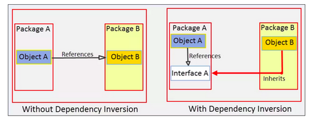

### SOLID Principles of Software Development

`Single Responsibility Principle:` Classes should have only one bussines responsibility at the time, avoid 'god' classes or 
interfaces with multiple responsibilities.

`Open Closed Principle:` Avoid changes in the existing code when requirements change. Instead, we should extend the existing 
functionality by adding new code. The principle states: "Software entities should be open for extension, but closed for modification".
"Open for extension" Existing code should be able to be extended. This can be achieved by using inheritance 
(abstract classes, interfaces) or polymorphism.
"Closed for Modification" The source code of such module remains unchanged.

Always think about how the app will change, and make sure your design will meet the future requirements without changing
the code, just "plugging" new business logic. Again, this can be achieve by using Interfaces, Abstract Classes, and / or Polymorphism.

`Liskov Principle`

`Interface Segregation Principle:` This principle states: “Clients should not be forced to depend on methods that they do not use”. 
Where "Clients" refers to the implementations of the interface. Keep the Single Responsibility principle and avoid "god"
interfaces. 

`Dependency Inversion Principle: ` Not to confuse with "Dependency Injection". States: 
A. High-level modules should not depend on low-level modules. Both should depend on abstractions.
B. Abstractions should not depend on details. Details should depend on abstractions.”
It's a mix of the Liskov principle and the Open Closed principle.

    * Both Object A and Object B now depends on Interface A, the abstraction.

    * It inverted the dependency that existed from Object A to Object B into Object B being dependent on the abstraction (Interface A).

#### Dependency Inversion Principle and the Spring Framework

Dependency Inversion is more focused on the structure of your code, its focus is keeping your code loosely coupled. 
On the other hand, Dependency Injection is how the code functionally works.
When programming with the Spring Framework, Spring is using Dependency Injection to assemble your application. 
Dependency Inversion is what decouples your code so Spring can use Dependency Injection at run time.