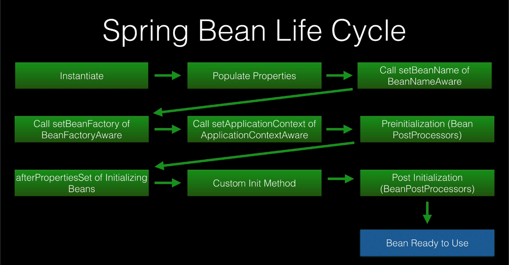

#### Inversion of Control

Is a principle in software engineering about separations of concerns. It transfers the control of the business logic 
to a container or framework.

In contrast with traditional programming, where our code makes calls to as library. IoC enables a framework to take control 
of the application and make calls to our custom code. If we want to add our own behavior. we need to extend the classes 
of the framework or plugin our own classes.

Advantages:

    * Decoupling execution flow and bussiness logic
    * Easier to switch between different implementations
    * Better modularity
    * Better testability by isolating components or mocking dependencies

IoC can be achieved through several ways. e.g.

    * Strategy Pattern
    * Service Locator Pattern
    * Factory Pattern
    * Dependency Injection

#### Dependency Injection

Is a technique that we can use to implement IoC by setting object's dependencies. Wiring objects with other objects relying on an 
assembler, rather than by the objects themselves. Example:

```
// Creating a dependency in traditional programming 
public class Store {
    private Item item;
 
    public Store() {
        item = new ItemImpl1();    
    }
} 
```
```
//Same example with manual DI by constructor (Non Spring)
public class Store {
    private Item item;
    
    public Store(Item item) {
        this.item = item;
    }
}
```

#### The Spring IoC Container

It's a framework that implements IoC, the ApplicationContext is responsible for instantiating, configuring and injecting
objects known as a beans. Also, it's responsible for managing their life cycles.   


#### Best Practices when Implementing DI

    * Make the field to be injected final and private (part of constructor injection)
    * Inject by constructor over setter and field
    * Add an interface whenever makes sense
    * Avoid injecting components with @Autowired (field injection)
    
#### Spring Bean Life Cycle



    * Instanciate
    * Populate Properties
    * Call setBeanName
    * Call setBeanFactory 
    * Call setApplicationContext
    * Preinizialization
    * Initialize Beans
    * Custom Init Method
    * Post Inizialization
    * Bean Ready to Use

##### @PostConstruct
Methods annotated will be called after the bean is constructed, but before it's returned to the requesting object. 

##### @PreDestroy    
Is called just before the bean is destroyed by the container.

### Bean Post Processors
Allows to interact with beans inside the Spring context life cycle. By implementing the interface `BeanPostProcessor`
and the methods:

    * postProcessBeforeInitialization 
    * postProcessAfterInizialization

Rarely used by developers